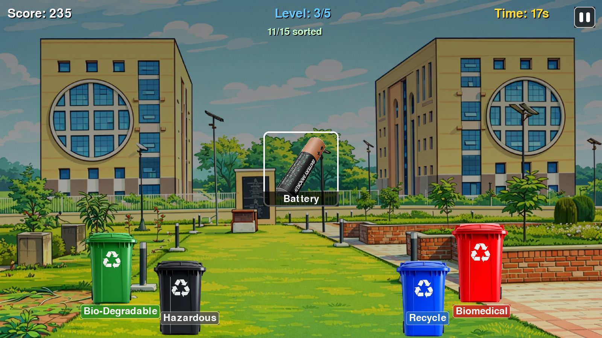
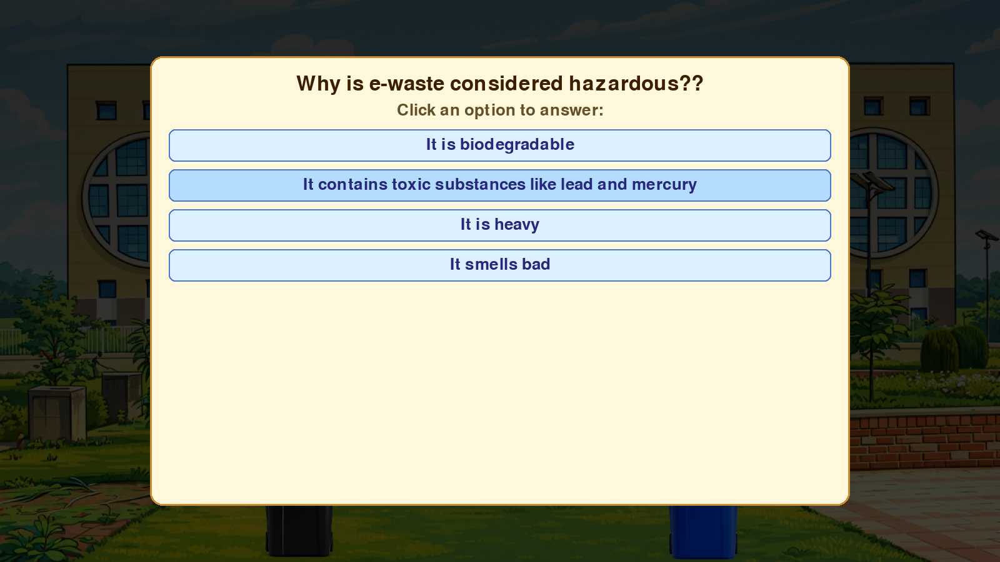
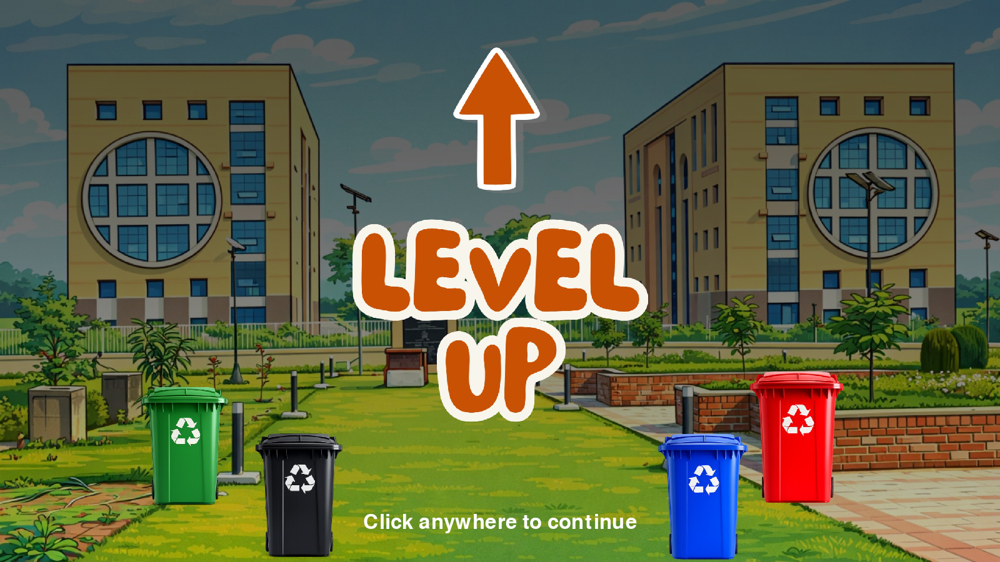
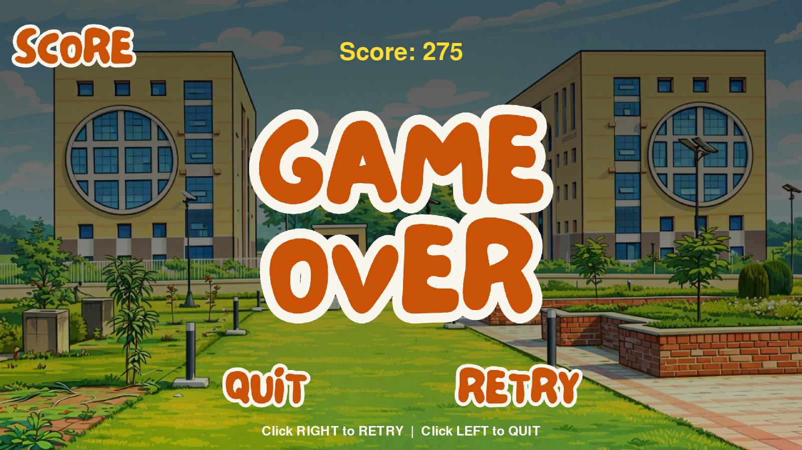

# Waste Segregation Challenge 

An interactive educational game built using Python and Pygame to promote awareness about waste segregation.

## Features :
- Multiple levels with increasing difficulty
- Real-world waste classification
- Quiz-based progression system
- Sound effects and animations

## How to Run
1. Install dependencies:
   pip install -r requirements.txt

2. Run the game:
   python main.py

## Controls
- Click bins to sort waste
- Answer questions to level up
- Pause button available in-game

## Gameplay
##### Interface

##### Question Screen

##### Level UP

##### Game Over

